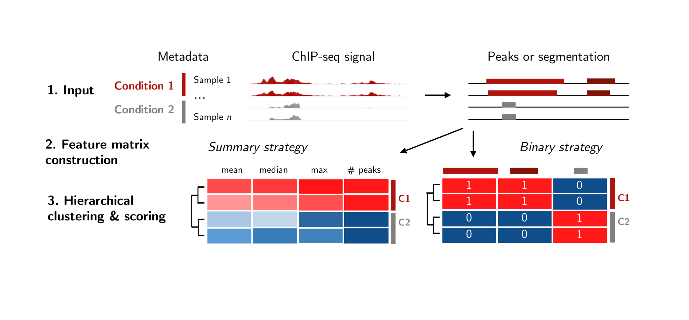
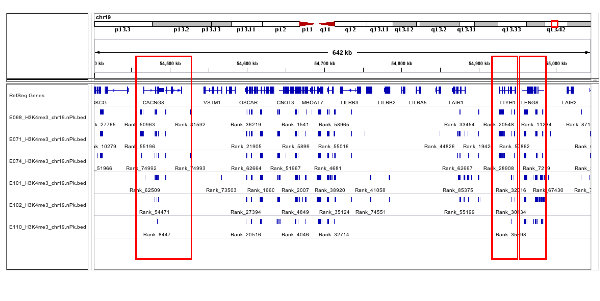
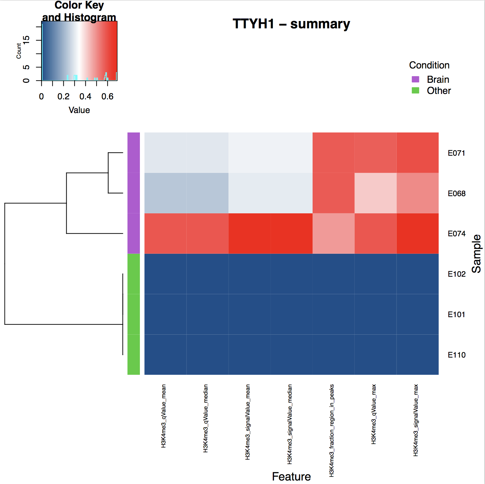
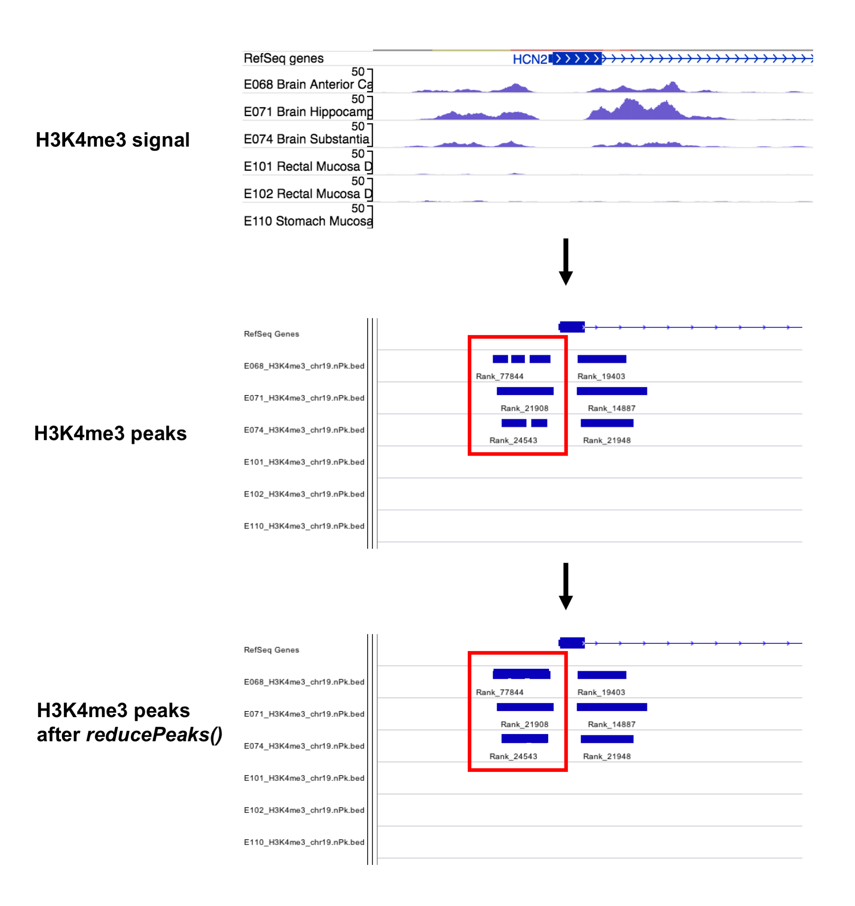

```{r echo = FALSE, warning = FALSE, message = FALSE}
library(BiocParallel)
register(bpstart(SerialParam()))
```

# Overview of this vignette

This vignette is organized hierarchically in terms of level of detail:

* In the Quickstart section, we show a basic analysis with
chromswitch using a small dataset included in the package.

* In the next section, we give a brief overview of the method for detecting
chromatin state switches, referencing specific
functions in chromswitch which implement the different steps of the method.

* In the Walkthrough, we demonstrate a basic analysis
chromswitch with a discussion of data import, input, the most important 
parameters available to the user, and interpretation of chromswitch output.
In this section we use the wrapper functions which
provide one-line commands to call chromatin state switches
based on a single mark or type of input data.

* In last section, Step-by-step, we demonstrate how the steps of the 
method can be run individually to gain finer control over the analysis and
show the intermediate results from chromswitch available to the user.

# Quickstart

Load `r Biocpkg("chromswitch")`:
```{r setup, warning = FALSE, message = FALSE}
library(chromswitch)
```

We will use the package `r Biocpkg("rtracklayer")` to import data from BED files:
```{r message = FALSE, warning = FALSE}
library(rtracklayer)
```

We'll start with a toy dataset containing MACS2 narrow peak calls for H3K4me3
ChIP-seq in 3 brain tissues and 3 other adult tissues from the Roadmap
Epigenomics Project, restricted to a short region on chromosome 19. In the code below, we import the input to chromswitch and run chromswitch on our dataset. This
involves constructing a feature matrix, and we will describe two ways of
doing so. We can then call chromatin state switches by thresholding on the value of
the Consensus score, which scores the similarity between the cluster assignments
and the biological condition labels.

Chromswitch essentially requires 3 inputs:

1. **Genomic query region(s)**: a `GRanges` object storing one or more regions of
interest
2. **Reference metadata dataframe**: a dataframe with at least two columns: *Sample* which stores
sample IDs (these can be any strings), and *Condition*, which stores the
biological condition labels of the samples (the conditions must be strings with only two different values in the column, *e.g.* 'Fetal'/'Adult' or 'WT'/'Mut'). Additional columns are not used.
3. **Reference peaks or epigenomic features**: a list of `GRanges` objects, each of which stores
peaks or features for one sample, with elements named according to the sample IDs as
specified in the metadata

The latter two inputs define the dataset on which the query is performed.

Each of these inputs can be imported from TSV or BED files. Learn more about `GRanges` objects by checking out `r Biocpkg("GenomicRanges")`.

Here we use the `import()` function from `r Biocpkg("rtracklayer")` to import
query regions stored in a BED file.
```{r qs_query}
# Path to BED file in chromswitch installation
query_path <- system.file("extdata/query.bed", package = "chromswitch")

# Read in BED file, creating a GRanges object
query <- rtracklayer::import(con = query_path, format = "BED")
query
```

```{r qs_meta}
# Path to TSV in chromswitch
meta_path <- system.file("extdata/metadata.tsv", package = "chromswitch")

# Read in the table from a 2-column TSV file
metadata <- read.delim(meta_path, sep = "\t", header = TRUE)
metadata
```

Here we assume that peaks are in the [ENCODE narrowPeak format](https://genome.ucsc.edu/FAQ/FAQformat.html#format12).

*Note:* If the metadata file has an additional column containing the path for each sample, then that column can be passed to this function,
*e.g.* `readNarrowPeak(paths = metadata$path, metadata = metadata)`.
```{r qs_pks}
# Paths to the BED files containing peak calls for each sample
peak_paths <- system.file("extdata", paste0(metadata$Sample, ".H3K4me3.bed"),
                     package = "chromswitch")

# Import BED files containing MACS2 narrow peak calls using 
#  a helper function from chromswitch
peaks <- readNarrowPeak(paths = peak_paths,  # Paths to files,
                        metadata = metadata) # Metadata dataframe
```

## Using the summary strategy

Run chromswitch using the summary strategy:
```{r quickstart_1, warning = FALSE}
callSummary(query = query,       # Input 1: Query regions
            metadata = metadata, # Input 2: Metadata dataframe
            peaks = peaks,       # Input 3: Peaks
            mark = "H3K4me3")    # Arbitrary string describing the data type
```

Chromswitch outputs a measure of cluster quality (*Average_Silhouette*), the score predicting a chromatin state switch (*Consensus*), and the cluster assignment for each sample.

Looking at the Consensus score in each case, which represents the similarity
between the cluster assignments and the biological groups of the samples,
here we see a good agreement in the first region, indicating a switch, and
poor agreement in the second, indicating the absence of a switch. This score takes on values between -1 and 1, where 1 represents a perfect agreement between cluster assignments and the biological conditions of the sample

## Using the binary strategy

Run chromswitch using the binary strategy:
```{r quickstart_2, warning = FALSE}
callBinary(query = query,       # Input 1: Query regions
           metadata = metadata, # Input 2: Metadata dataframe
           peaks = peaks)       # Input 3: Peaks
```

The output has the same format for both strategies. In this case, both strategies predict a switch for the first region, and a non-switch for the second region. 

Both of these wrapper functions have additional parameters which allow for greater
sensitivity and finer control in the analysis. These are explored in the
rest of the vignette.

# Overview of the method

Our method for detecting chromatin state switches involves three steps.
These are illustrated in the figure below, which is a schematic for the analysis
performed on one query region, based on the reference metadata and peaks or features.

As input,
chromswitch requires epigenetic features represented by their genomic
coordinates and optionally, some associated statistics. Possible examples
include ChIP-seq or DNase-seq peaks, or previously-learned chromatin state
segmentations such as from ChromHMM. Here we'll refer to peaks for simplicity, but the analysis 
is the same for other types of epigenetic features given as intervals.

In the pre-processing phase, the user can set thresholds on any statistics
associated with peaks and filter out peaks below these thresholds
(`filterPeaks()`). These statistics can then be normalized genome-wide for each
sample (`normalizePeaks()`), which is strongly recommended. More detailed discussion of the normalization process
can be found in the documentation of that function.
Both these steps are optional. We then retrieve all the peaks in each sample
which overlap the query region (`retrievePeaks()`).

Next, chromswitch transforms the peaks in the query region into a
sample-by-feature matrix using one of two strategies. In the summary strategy
(`summarizePeaks()`), we compute a set of summary statistics from the peaks 
in each sample in the query region. These can include the mean, median, and max
of the statistics associated with the peaks in the input, as well as the 
fraction of the region overlapped by peak and the number of peaks. Genome-wide normalization of the data is therefore extremely
important if choosing this strategy.

In the binary strategy (`binarizePeaks()`) we
construct a binary matrix where each feature corresponds to a unique peak in the
region, and the matrix holds the binary presence or absence calls of each
unique peak in each sample. We obtain the unique peaks by collapsing the union
of all peaks in the region observed in all samples using a parameter `p`
which specifies how much reciprocal overlap is required between two peaks to
call them the same. Since regions corresponding to the same biological event
can occasionally result in separate peaks during the process of interpretation
of raw signal, peak calling, *etc.*, we also introduce an option to combine
peaks which are separated by less than `gap` base pairs (`reducePeaks()`).

Finally, chromswitch clusters samples hierarchically
and then scores the similarity between the inferred cluster assignments and the
known biological condition labels of the samples (`cluster()`).


*Schematic of the method outlined above.*

# Walkthrough of a basic chromswitch analysis

## The H3K4me3 dataset

The package ships with a small dataset that we will analyze to detect brain-
specific chromatin state switches. The dataset contains MACS2 narrow
peak calls for H3K4me3 in a short section of chromosome 19 for six samples,
3 adult brain tissues, and 3 other adult tissues. The peaks are available
as BED files, stored in the *extdata* folder of chromswitch, as well as in the 
object `H3K4me3`, which is a list of length 6. Each element of the list stores the peak calls as `GRanges` objects. `GRanges` objects are sets of genomic ranges,
and here, one range describes one peak. The data packaged with chromswitch is described in the manual, and the documentation can be accessed by running `??chromswitch::H3K4me3` in the console.


*Genome browser screenshot of H3K4me3 dataset included in the chromswitch package. Red boxes indicate the genes studied in the demo analysis in this section.*

## Input

Chromswitch essentially requires 3 inputs:

1. **Genomic query region(s)**: the genomic windows in which chromswitch will be applied
(indpendently to each region) to call chromatin state switches.
2. **Metadata dataframe**: specifying the sample IDs and biological conditions,
used to score the similarity between the clusters of samples inferred by
chromswitch, and the biological conditions of the samples.
3. **Epigenomic features**: for example, ChIP-seq peaks for a histone mark, DNase-seq peaks, or previously-learned chromatin state segmentations such as from ChromHMM.

The specification for the inputs and examples of how to import them are described below.

### Query regions

Chromswitch expects query regions in the form of a `GRanges` object storing one or more regions of interest. GRanges objects are containers for genomic regions, implemented
in `r Biocpkg("GenomicRanges")`. An introduction to these objects can be obtained by running `??GenomicRanges::GRanges_and_GRangesList_slides` in the console.

We will apply chromswitch to 5kbp windows surrounding chromatin state
switches in three genes on chromosome 19. Here, we will read in the query regions
from a BED file using the `import()` function from `r Biocpkg("rtracklayer")`. 

```{r regions}
# Path to BED file in chromswitch installation
query_path <- system.file("extdata/query.bed", package = "chromswitch")

# Read in BED file, creating a GRanges object
query <- rtracklayer::import(con = query_path, format = "BED")
query
```

If your query regions are stored in another tabular format, this table can be read
in using `read.delim()` and passed to the `makeGRangesFromDataFrame()` function from `r Biocpkg("GenomicRanges")`, which converts query regions stored in a dataframe with at least 3 columns, *chr*, *start*, and *end*, into a `GRanges`
object (remember the `keep.extra.columns = TRUE` argument to preserve any
additional data associated with the regions, such as gene symbols). Any metadata
columns in the `GRanges` object passed to the `query` argument will be included
in the chromswitch output (but not used for the analysis).

### Metadata

Chromswitch accepts metadata in the form of a dataframe with at least two columns: *Sample* which stores
sample IDs (these can be any strings), and *Condition*, which stores the
biological condition labels of the samples (these must be strings, with only two
possible values in the column). Additional columns are not used. 

In the code below, we read in the metadata from a TSV file.
The resulting dataframe can be passed to the `metadata` argument of any chromswitch
functions that require it.

```{r meta}
# Path to TSV in chromswitch
meta_path <- system.file("extdata/metadata.tsv", package = "chromswitch")

# Read in the table from a 2-column TSV file
metadata <- read.delim(meta_path, sep = "\t", header = TRUE)
metadata
```

### Epigenomic features

Chromswitch expects epigenomic features in the form of a named list of `GRanges` objects,
each of which stores
peaks or features for one sample, with elements named according to the sample IDs as
specified in the metadata. The peaks should be in the same order (with respect
to samples) as in the metadata.

The nature of these features are flexible: for example, they can include peak calls
from a ChIP-seq or DNase-seq experiment, or assignments of a certain state obtained
from a previously learned chromatin state segmentation such as from ChromHMM.
These features may be attached to certain metrics quantifying enrichment,
significance, or probabilities, and the format of the data
will control how we import it. Here we focus on narrow peaks for H3K4me3 ChIP-seq, but demonstrate three ways of importing data into
`GRanges` objects, each suitable for different formats.

**Option 1**: To import BED files containing peak MACS2 narow peak calls, we can use a helper
function implemented in chromswitch, which processes peaks which follow
exactly the [ENCODE narrowPeak format](https://genome.ucsc.edu/FAQ/FAQformat.html#format12).

```{r paths}
# Paths to the BED files containing peak calls for each sample
peak_paths <- system.file("extdata", paste0(metadata$Sample, ".H3K4me3.bed"),
                     package = "chromswitch")

# Import BED files containing MACS2 narrow peak calls using 
#  a helper function from chromswitch
peaks <- readNarrowPeak(paths = peak_paths,  # Paths to files,
                        metadata = metadata)

# Ensure the list is named by sample
names(peaks) <- metadata$Sample
```

**Option 2**: To read in features in other formats where the first three columns are *chr*, 
*start*, and *end*, use `r Biocpkg("rtracklayer")` and specify the identity and
type of the other columns. For example, we can read in the narrow peak calls
manually. 
The same process can be applied to BED files containing epigenomic features
other than peaks (for example, chromatin state segmentations); the `extraCols`
argument to `rtracklayer::import` should be modified to fit the data. More information about importing BED files can be obtained by
running `??rtracklayer::BEDFile` in the console to access the `rtracklayer`
documentation.

```{r read}
extra_cols <- c("name" = "character",
                "score" = "integer",
                "strand" = "character",
                "signalValue" = "numeric",
                "pValue" = "numeric",
                "qValue" = "numeric",
                "peak" = "numeric")

# Obtain a list of GRanges objects containing peak calls
peaks <- lapply(peak_paths, rtracklayer::import, format = "bed",
                   extraCols = extra_cols)

# Ensure the list is named by sample
names(peaks) <- metadata$Sample
```

**Option 3**: Alternatively, if your epigenomic features are stored in another tabular format,
read in the files using `read.delim()` and convert them to `GRanges` objects
afterwards. We demonstrate on the same narrow peak calls:

```{r manual}
# Read in all files into dataframes
df <- lapply(peak_paths, read.delim, sep = "\t",
             header = FALSE,
             col.names = c("chr", "start", "end", "name", "score", 
                           "strand", "signalValue", "pValue",
                           "qValue", "peak"))

# Convert the dataframes into GRanges objects, retaining
# additional columns besides chr, start, end
peaks <- lapply(df, makeGRangesFromDataFrame, keep.extra.columns = TRUE)

# Ensure the list is named by sample
names(peaks) <- metadata$Sample
```

All three methods described above produce an identical `peaks` object.

## Applying the summary strategy to detect brain-specific switches

We will first run a basic analysis using the summary strategy
for constructing 
feature matrices, using the default features under the summary matrix
construction strategy: the number of peaks in the region, and the fraction
of the region overlapped by peaks. Note that whne the number of peaks is large
($n >> 1$), the output, particularly the heatmap, may be difficult to interpret.
All the computations described in the method are 
wrapped in one command; in later sections we'll explore running each 
step of the method (preprocessing, feature matrix construction, clustering)
individually.

Note that the column names passed to arguments in the wrappers (*e.g.*
`normalize_columns`, `summarize_columns`, *etc.*) must match exactly the column
names in the BED files.

```{r summary_basic, warning = FALSE}

out <- callSummary(query = query, # Input 1: Query regions
            metadata = metadata,  # Input 2: Metadata dataframe
            peaks = peaks,        # Input 3: Peaks
            mark = "H3K4me3")     # Arbitrary string describing the data type

out

```

We can threshold on the consensus score to subset the query regions to those
containing putative chromatin state switches:

```{r threshold}
out[out$Consensus >= 0.75, ]
```

Now, we'll construct the feature matrix by summarizing on the `qValue` and
`signalValue` statistics. This means that for each sample, the features used to
the cluster samples in the
region will be the mean, median, and maximum of these two statistics across
peaks. We will apply genome-wide normalization to the same columns we will use
in the feature matrices. Normalization is an optional step, but
strongly recommended.

Let's explore some more options for detecting chromatin state switches
with chromswitch. The options are briefly described in the comments,
but you can obtain additional explanation of arguments and explore others
not covered here by running `??chromswitch::callSummary`. Note that wherever
column names are passed to chromswitch functions, these *must* match the columns
in the peaks/features data exactly (this is case sensitive).
```{r summary2, warning = FALSE}

out2 <- callSummary(
                # Standard arguments of the function
                query = query,
                metadata = metadata,
                peaks = peaks,
                
                # Arbitrary string describing data type
                mark = "H3K4me3",

                # For quality control, filter peaks based on associated stats
                # prior to constructing feature matrices
                filter = TRUE,
                # Provide column names and thresholds to use in the same order
                filter_columns = c("qValue", "signalValue"),
                filter_thresholds = c(10, 4),

                # Normalization options
                normalize = TRUE, # Strongly recommended
                # By default, set to equal summarize_columns, below
                normalize_columns = c("qValue", "signalValue"),

                # Columns to use for for feature matrix construction
                summarize_columns = c("qValue", "signalValue"),

                # In addition to summarizing peak statistics,
                # we can also optionally compute the
                # fraction of the region overlapped by peaks
                # and the number of peaks
                fraction = TRUE,
                n = FALSE,
                
                # TRUE by default, return the optimal number
                # of clusters, otherwise require k = 2
                optimal_clusters = TRUE,
                
                # Set this to TRUE to save a PDF of the heatmap
                # for each region to the current working directory
                heatmap = FALSE,
                
                # Chromswitch uses BiocParallel as a backend for
                # parallel computations. Analysis is parallelized at the
                # level of query regions.
                BPPARAM = BiocParallel::SerialParam())

out2

```

The summary approach can be applied to epigenomic data where there
are no statistics associated with the features (peaks, states, *etc.*). In this
case, set `summarize_columns = NULL`, `filter = FALSE`, `normalize = FALSE`,
and ensure that either `n` or `fraction` (or both) are set to `TRUE`.

## Applying the binary strategy to detect brain-specific switches

The binary strategy requires approximately the same basic
input as the summary strategy. It also uses two tuning parameters:

1. `gap` which is the distance between peaks in the same sample below which
two peaks should be merged. This preprocessing step is optional, and is 
controlled by the option `reduce`
2. `p` which is the fraction of reciprocal overlap required to call two
peaks the same. This rule is used to obtain a set of unique peaks observed
across samples in the query region, and to assign binary presence or absence
of each peak in each sample to construct the feature matrix.

We use default values of `gap = 300` and `p = 0.4`, but the method is robust
to changes in these parameters within reasonable ranges.

The other option unique to this strategy is `n_features`. The number of features
in the matrix used for clustering corresponds to the number of unique peaks
that chromswitch identifies for these samples in the query region, and
this option controls whether to include an additional column recording 
the number of features in the output.

Additional parameters can be explored by running `??chromswitch::callBinary`
in the console.

```{r binary_basic, warning = FALSE}
out3 <- callBinary(
                # Standard arguments of the function
                query = query,
                metadata = metadata,
                peaks = peaks,
                
                # Logical, controls whether to
                # reduce gaps between peaks to eliminate noise
                reduce = TRUE,
                # Peaks in the same sample which are within this many bp
                # of each other will be merged
                gap = 300,
                
                # The fraction of reciprocal overlap required to define
                # two peaks as non unique, used to construct a binary ft matrix
                p = 0.4,
                
                # Include in output the number of features obtained in 
                # each query region
                n_features = TRUE)

out3
```

Again, threshold the output to obtain putative switches: 
```{r threshold2}

out3[out3$Consensus >= 0.75, ]

```

## Output

The basic output of chromswitch is a tidy dataframe which includes:

* The query regions and any additional data associated with the query (here, 
the name of the gene)
* The number of clusters inferred in the region ($k = 2$ if
`optimal_clusters = FALSE`,
otherwise, the optimal set of clusters is obtained by selecting the clusters
with the highest average Silhouette width, displayed in the next column)
* The Average Silhouette score, which measures cluster compactness and
separation, and can be interpreted as assessing the internal consistency
of the clustering
* A score of the similarity between the inferred clusters and the
biological condition labels of the samples (here, Brain and Other), labeled
as "Consensus", which is an average of the Adjusted Rand Index (ARI),
the Normalized Mutual Information (NMI), and the V measure. This is the score
we recommend to use for later filtering, and thresholding. This score takes
on values between -1 and 1, where 1 represents a perfect agreement between
cluster assignments and the biological conditions of the sample
* The cluster assignments for each sample, one sample per column


## Saving chromswitch heatmaps

If chromswitch performs hierarchical clustering on a feature matrix with more
than one feature, both wrapper functions, `callSummary()` and `callBinary()`
as well as `cluster()` can optionally
produce a heatmap with the resulting dendrogram as a PDF. Whether this 
heatmap is produced or not is passed as a logical value to the argument `heatmap`.
The title of the heatmap and prefix of the file name can be passed as a string
to `title`, while the path to the output directory can be passed to `outdir`.

# Step-by-step analysis for finer control

Chromswitch is implemented in a relatively modular way, with functions for each
step of the method. In this section, we repeat the analysis we performed in 
the previous sections, except that instead of using the wrapper functions,
`callBinary()` and `callSummary()`, we perform each step individually, and 
allocate some more discussion to options and parameters at each step.

This section leverages the modularity of chromswitch, so the pipe operator `%>%`
from `r CRANpkg("magrittr")` is helpful here.

```{r pipe}
library(magrittr)
```

We will also inspect some of the intermediate objects returned by chromswitch
functions, so we load the data manipulation package, `r CRANpkg("dplyr")`.

```{r dplyr, warning = FALSE, message = FALSE}
library(dplyr)
```

## Filter peaks
After preparing the metadata dataframe (`meta`) and importing data into GenomicRanges
objects (`H3K4me3`), we can pre-process the data. First, since the peak calls
from MACS2 are associated with a fold change of enrichment of ChIP-seq
signal, a *q* value for enrichment, *etc.*, we'll set
some thresholds on these statistics and filter out peaks which do not meet them.
The user can pass the names of any numeric columns in the data to the `columns`
argument, ensuring that a numeric threshold for each is passed to `thresholds`,
in the same order. If too few threshold values provided, they will not be
recycled; chromswitch will return an error.

```{r filter}
# Number of peaks in each sample prior to filtering
lapply(H3K4me3, length) %>% as.data.frame()

H3K4me3_filt <- filterPeaks(peaks = H3K4me3,
                            columns = c("qValue", "signalValue"),
                            thresholds = c(10, 4))

# Number of peaks in each sample after filtering
lapply(H3K4me3_filt, length) %>% as.data.frame()
```

There are some additional pre-processing steps which are specific to the approach
used to construct feature matrices from the data, and we explain these below.

## Summary approach for constructing feature matrices

### Normalization
In the summary approach, the features for each sample are a set of summary
statistics which represent the peaks observed in that sample in the query region.
It's important, therefore, that the features have comparable ranges. We
normalize each statistic genome-wide for each sample. The normalization process
essentially involves rescaling the central part of the data to the range [0, 1]
and bounding the lower and upper outliers to 0 and 1 respectively. The amount
of outliers in each tail to bound can be specified by the user in the `tail`
parameter, which expects a fraction in [0, 1] (for example, `tail = 0.005` results
in bounding the upper and lower 0.5% of the data, the default).

This normalization is optional, but is strongly recommended. The effect of *not*
normalizing is that the hierarchical clustering algorithm will be influenced
by small changes between samples, which may lead to false positive chromatin
state switch calls.

```{r normalize}
# Summary of the two statistics we will use downstream in raw data in one sample
H3K4me3_filt %>% lapply(as.data.frame) %>%
    lapply(select, signalValue, qValue) %>%
    lapply(summary) %>% 
    `[`(1)

H3K4me3_norm <- normalizePeaks(H3K4me3_filt,
                               columns = c("qValue", "signalValue"),
                               tail = 0.005)

# Summary after normalization
H3K4me3_norm %>% lapply(as.data.frame) %>%
    lapply(select, signalValue, qValue) %>%
    lapply(summary) %>% 
    `[`(1)
```

### Retrieve peaks in the query region
Next, we'll retrieve the peaks in the query region. Here we'll consider the 
5 kbp window around the transcription start site of *TTYH1*, which is a known
brain-specific gene. This returns an object of the `LocalPeaks` class.
A `LocalPeaks` object is a container for the peaks for a set
of samples in a specific genomic region of interest, as well as the genomic region
itself, and the sample IDs. These components are needed to convert sets of peaks
into rectangular feature-by-sample matrices which we can then use for downstream
analysis - and in particular, as input to a clustering algorithm in order to
call a chromatin state switch.

```{r retrieve}
# TTYH1 
ttyh1 <- query[2]
ttyh1

ttyh1_pk <- retrievePeaks(peaks = H3K4me3_norm,
                          metadata = metadata,
                          region = ttyh1)

ttyh1_pk
```


### Selecting features for the feature matrix in the summary approach
We can now construct a sample-by-feature matrix from the filtered and normalized
data in the query region.
To do so, we need to select some summary statistics to be the features
in the matrix. If there are any values associated with the peaks or data,
specifying these in the `cols` parameter to `summarizePeaks()` results in taking the mean, median, and maximum of each statistic as a separate feature. There are also two
measures which can be calculated from genomic ranges alone: the number of peaks
overlapping the query region (argument `n`), and the fraction of the region
overlapped by peaks (argument `fraction`). These parameters take logical
values specifying whether or not they should be included.

Here, we take the mean, median, and max of the *q* value and fold
change of peaks in the query region, as well as the fraction of the region
overlapped by peaks. When selecting which peak statistics to use in feature
construction, it's important to consider whether statistics are redundant,
for example, here we avoid using both the *p* and *q* values.

```{r summarizePeaks}
summary_mat <- summarizePeaks(localpeaks = ttyh1_pk,
                              mark = "H3K4me3",
                              cols = c("qValue", "signalValue"),
                              fraction = TRUE,
                              n = FALSE)

# The sample-by-feature matrix
summary_mat
```

### Cluster
Finally, we can cluster over samples using this matrix, and call a chromatin
state switch by assessing the agreement between the inferred cluster assignments
and the known biological condition labels of the samples. Since hierarchical
clustering results in a dendrogram, we choose the partition of the samples which
maximizes the average Silhouette width, which is an internal measure of cluster
goodness based on cluster compactness and separation.

```{r cluster}

cluster(ft_mat = summary_mat,
        query = ttyh1,
        metadata = metadata,
        heatmap = TRUE,
        title = "TTYH1 - summary",
        optimal_clusters = TRUE)

```

The consensus score is equal to 1, indicating a perfect agreement between the
inferred clusters and the biological groups (Brain/Other), so we can infer
a chromatin state switch around the TSS of *TTYH1*.

The `cluster` function has a `heatmap` argument which controls whether a heatmap
is produced as a PDF file in the current working directory or at a path specified by `outdir`.



*Heatmap showing hierarchical clustering result from chromswitch applied to
TTYH1 using the summary strategy*

## Binary approach

### Reduce peaks
In the binary approach, the features correspond to unique peaks observed in the
region across samples. This can be sensitive to noisy data in the region, so
we propose an additional pre-processing step prior to this approach. When
considering peaks, often, we observe two scenarios:

1. Two peaks may be called as separate
peaks but result from the same biological event
2. Two overlapping peaks may not necessarily correspond to the same biological signal

The way chromswitch handles these is controlled by two tuning parameters. The first
is the `gap` parameter, and is used to decide when nearby
peaks should be joined and replaced by one peak. The `gap` parameter is the distance
between two peaks below which they should be joined.


*Example of a transformation on peaks to join nearby peaks which are likely due
to the same biological event, implemented in chromswitch as `reducePeaks()`.*

The `reducePeaks()` function takes a `LocalPeaks` object as input, so we can
use the peaks in the *TTYH1* window that we've already obtained.
```{r reduce}

ttyh1_pk_red <- reducePeaks(localpeaks = ttyh1_pk,
                            gap = 300)

```

### Construct feature matrix
In this approach, we convert the data in the query region into a binary representation
by modelling the presence or absence of each unique peak. In this function,
first the unique peaks are obtained by collapsing down the *union* of all peaks
supplied in the region, and then we look for each unique peak in each sample
to construct the binary matrix. This involves using the second tuning parameter,
`p`, which specifies how much reciprocal overlap two peaks must have in order
to be considered the same peak.

```{r binarizePeaks}
binary_mat <- binarizePeaks(ttyh1_pk_red,
                            p = 0.4)

# Chromswitch finds a single unique peak in the region
binary_mat
```

In terms of selecting values for these tuning parameters, our experiments indicate
that chromswitch is very robust to changes in these parameters, within reasonable
ranges. Visual inspection of the data in a genome browser can be useful for
determining exact values, and can help to control the resolution of the analysis.

### Cluster

Again, chromswitch finds good agreement between the cluster assignments and
the biological groups in our analysis.
```{r cluster2}

cluster(ft_mat = binary_mat,
        metadata = metadata,
        query = ttyh1,
        optimal_clusters = TRUE)

```

These steps can also be easily run in a pipeline using the `%>%` operator, which is convenient when using individual chromswitch functions to compose an analysis rather than the two wrapper functions.

# Bug reports and support

Bug reports and questions about usage, the method, *etc.* are welcome. Please open an issue on the
GitHub repository for the development version of chromswitch: https://github.com/sjessa/chromswitch/issues/new.

# Session Info
```{r session}
sessionInfo()
```
